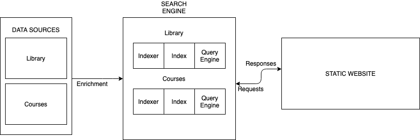

# Laakaye

`Làákàyè` means `wisdom` or `discretion` in [Yoruba](https://en.wikipedia.org/wiki/Yoruba_language) Language.

`Laakaye` (this project) demonstrates the knowledge mining capabilities of Azure Cognitive Search. In particular, we leverage Azure Cognitive Search solution to search a corporate trainining catalogue comprising a CSV files and a library of PDF documents. The documents are enriched using skillsets that extract key words and phrases, entities etc. Two custom skills are also integrated to provide information about course instructors and the publisher, publication name and date, and Digital Object Identifier (DOI) of the research papers in the catalogue. 

End users interact with the search service through the deployed website and can retrieve and filter information from the catalogue as they require for their training. 
## Note
All required items are included in the [outputs](outputs/) folder. Only the design requirements and architectural diagram are included in this README.

## Design Requirements
- Users can retrieve information about courses by searching relevant keywords and phrases
- Users can filter returned results using criteria such as course ratings and duration
- Users can retrieve course instructor profiles
- Users can facet information using relevant fields: source, skills, role
- Users can sort information by relevant fields
- Users can retrieve information from journal articles related to their big data work using keywords and phrases, authors and their associated institutions
- Users can retrieve journal articles by searching publication name, publisher and publication date.
- Users can retrieve the DOI (Digital Object Identifier) for journal articles

## Architecture
